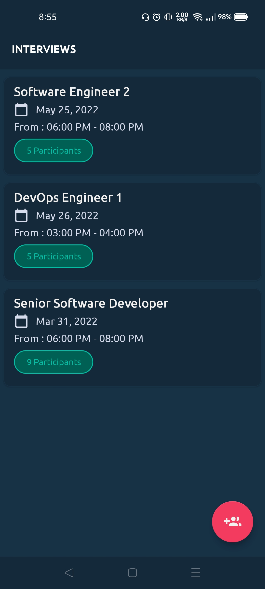
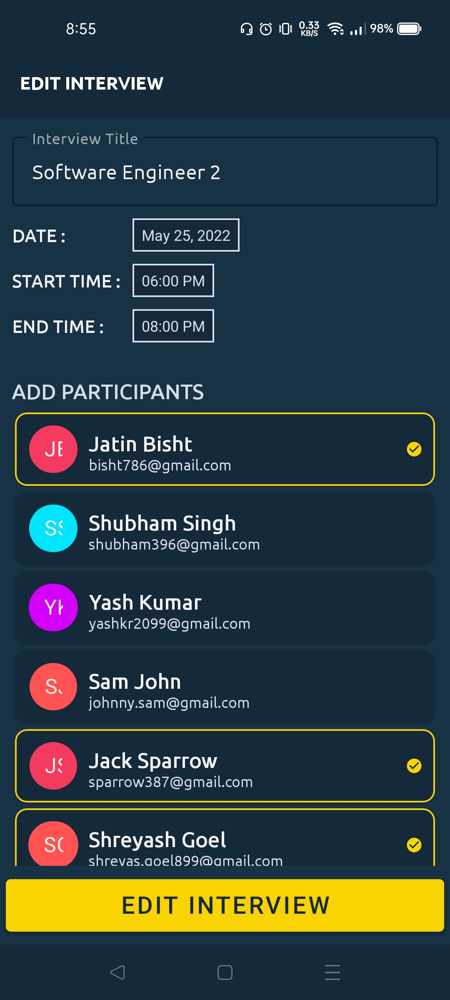
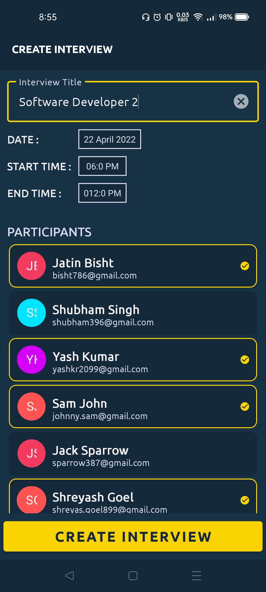

# Interview-Portal - An android application for scheduling Interviews with multiple participants following MVVM Architecture

## :computer: CODE BASE

- :x: NO Errors
- :x: NO Hard Coded Code
- :x: NO Boiler Plate Code
- :heavy_check_mark: 100% KOTLIN
- :heavy_check_mark: MVVM Architecture 
- :heavy_check_mark: Naming Convention Followed
- :heavy_check_mark: Well Maintained Package Structure
- :heavy_check_mark: Followed Single Activity Pattern

## ⚙ TECH USED
- Kotlin
- Model-View-Viewmodel Architecture
- Navigation component
- Firebase Database
- Live Data
- ViewModel
- DiffUtil
- Coroutines
- ViewBinding
- Dagger Hilt

## APP FEATURES
- Display Interview List
- Schedule Interview
- Edit already Scheduled interview
- Upload Resume
- Material Design Components
- Survives Configuration changes

## SETUP - 
- Download directly on Android device -    

- Clone this URL in Android Studio - https://github.com/YashKr01/Interview-Portal.git

## SCREENSHOTS

 | List Of Interviews | EDIT Scheduled Interviews | Schedule New Interviews | Upload Resume |
 --------------|------------|-------------| -------------|
 |  |   |  |  |
 
 https://github.com/YashKr01/Interview-Portal/releases/download/v2.0.0/app-debug.apk

